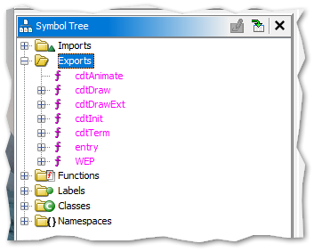
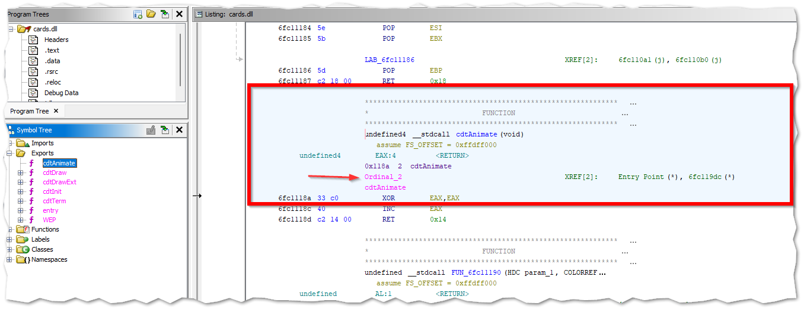
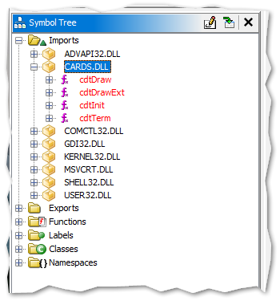

# MS Solitaire XP DLL Proxying Example

This project demonstrates how to write a proxy DLL to hijack a game/application via DLL proxying.
Specifically, this project targets the old game, MS Solitaire XP, and proxies the original cards.dll.

## How the Proxy Works

The proxy works by redirecting calls from the Solitaire game that are intended for the cards.dll to our proxy DLL (cards.dll).
Once the calls are intercepted by our proxy, we can execute any additional code (for instance, any "weaponized" code), and then forward these calls to the original cards.dll (which we've renamed to cards_og.dll).

## Function Forwarding with `cards.def`

In our project, not all functions from the original `cards.dll` are intercepted for modifications. Many of them are simply forwarded to the original DLL without any intervention on our part.

The `cards.def` file describes these functions. When the Solitaire game makes a call to any of these functions, our proxy DLL will transparently forward the call to the original `cards.dll` (renamed to `cards_og.dll`). This ensures that only specific functions (those we choose) are intercepted and modified, while the rest maintain their original behavior.

Here's a snippet from the `cards.def` file:

```
EXPORTS
cdtAnimate=cards_og.dll.cdtAnimate @2
cdtDraw=cards_og.dll.cdtDraw @3
cdtDrawExt=cards_og.dll.cdtDrawExt @4
cdtTerm=cards_og.dll.cdtTerm @6
```

For functions where we intend to introduce our own behavior or code, we need to provide their definitions in the `cards_proxy.cpp` file. This allows us to modify, intercept, or enhance their behavior as needed.

### Dissecting the Function Forwarding Line

In our proxying mechanism, we use a special syntax to seamlessly redirect function calls from our proxy DLL to the original DLL. Let's decipher the components of this line from the `cards.def file:`

```
EXPORTS
cdtAnimate=cards_og.dll.cdtAnimate @2
...
```

- **`cdtAnimate`**=cards_og.dll.cdtAnimate @2
  - The advertised function name in **our** proxy DLL.
  - Represents the name by which other programs or DLLs recognize and call this function.
- cdtAnimate **`=`** cards_og.dll.cdtAnimate @2
  - Signifies redirection.
  - Any call to the function on the left is assigned or redirected to the specified location on the right.
- cdtAnimate=**`cards_og.dll`**.cdtAnimate @2:
  - The original DLL's name that houses the genuine function.
  - Since we're proxying, we intercept calls meant for this original DLL.
- cdtAnimate=cards_og.dll **`.`** cdtAnimate @2
  - Denotes membership.
  - Implies that the function we're pointing to is housed within `cards_og.dll`.
- cdtAnimate=cards_og.dll.**`cdtAnimate`** @2
  - The genuine function's name in the original DLL.
  - This is where the call will eventually be directed to.
- cdtAnimate=cards_og.dll.cdtAnimate **`@2`**
  - The `@` symbol followed by an integer value is used to mark the ordinal for a function. (See: [Ordinals](#ordinals-the-x-notation-at-the-end-of-a-function-name)
    )

### Ordinals (the @x notation at the end of a function name in a .def file)

In the context of Windows DLLs, an ordinal is a unique number that is associated with a function or a resource within the DLL. Ordinals serve as alternative "names" for exported functions and can be used for more efficient function lookups.

Each function that a DLL exports can be identified in two ways:

By Name: The function can be called by its explicit name. For example, the cdtAnimate function can be called by looking up "cdtAnimate" in the DLL's export table.

By Ordinal: Instead of using the function's name, the function can be called by its ordinal, which is an integer value. This method is faster since it doesn't involve string comparisons.

In the line cdtAnimate=cards_og.dll.cdtAnimate @2, the @2 specifies the ordinal value of the cdtAnimate function. This means that if a program requests the function with ordinal 2 from your proxy DLL, it will be redirected to the cdtAnimate function in the cards_og.dll.

## Dive Deeper with Code Comments

For those interested in a more in-depth understanding of the DLL proxying mechanism, refer directly to the `cards_proxy.cpp` file. I've included detailed comments for each significant code segment, ensuring that you grasp the nuances of each operation. Whether you're a beginner or an expert, the code annotations will guide you through the intricacies of DLL proxying in this project.

## Building the Project with MSYS2

1. Compile the DLL Proxy:

   - Build the project by running the `build.sh` script:
     ```bash
     sh build.sh
     ```
     This script generates the proxy `cards.dll`. For a detailed explanation of how the `build.sh` script works, please refer to the comments inside the `build.sh` script itself.

2. Setup Game Directory:

   - Navigate to the MS Solitaire XP game directory.
   - Rename the original `cards.dll` to `cards_og.dll`.
   - Copy the generated `cards.dll` (produced from this project) to the game directory.

3. Run MS Solitaire XP:
   - Launch the game. It will now use the proxy DLL, which intercepts and can modify the behavior of certain functions.

## Setting up MSYS2 on Windows (only for Windows users that don't have MSYS2 installed)

To compile the project on Windows, we recommend using MSYS2. Here's how to set it up:

1. Install MSYS2: Download and install MSYS2 from their official website: https://www.msys2.org/.
2. Launch MSYS2: Start the MSYS2 application.
3. Install GCC: In the terminal window that appears, execute the following command to install the GCC compiler:

```bash
pacman -S mingw-w64-x86_64-gcc
```

4. Install Additional Tools: Execute the following command to install necessary tools and libraries:

```bash
pacman -S --needed base-devel mingw-w64-i686-toolchain
```

> When prompted, press Enter to install all suggested packages.

# Investigating DLL Exports and Usage with Ghidra

## Introduction

Ghidra is a powerful open-source software reverse engineering tool. It's particularly adept at disassembling executables and providing a plethora of analysis utilities, one of which is the capability to view the functions exported by a DLL and their usage within an executable.

You can download Ghidra from: https://ghidra-sre.org/

## Step-by-step Guide

1. Importing the DLL/EXE into Ghidra:
   - Start Ghidra and create a new project.
   - Within your Ghidra project, use the `File` > `Import File` option to import the DLL or EXE of interest.
2. Viewing Exported Functions from a DLL:

   - Once the DLL is imported and analyzed, view the `Exports` section in the `Symbol Tree`.

     

   - Double click the desired function to view its details. (in this case the function `cdtAnimate`).

   

   - It will automatically jump to the function definition in the `Code Browser`.
   - Here you will also see the ordinal of the function. (in this case, 2).

3. Identifying DLL Function Usage in an EXE:

   - With the EXE file imported and analyzed in the same project, you can view the `Imports` section in the `Symbol Tree`.
   - In this case, we want to open the `CARDS.DLL` node.

   

   - Once we've determined which functions from our DLL are being utilized by other DLLs or executables, we then understand which functions our proxy DLL (in this case, the `cards.dll`) needs to provide. These can be specified in the `.def` file or implemented and forwarded within the `.cpp` file.
   - For instance, in our scenario, only the solitaire executable (`sol.exe`) interacts with the `cards.dll` file. The executable specifically calls upon the functions: `cdtDraw`, `cdtDrawExt`, `cdtInit`, and `cdtTerm`. Therefore, we must forward these functions in our proxy DLL, either by listing them in the `.def` file or by implementing and forwarding them in the `.cpp` file. If we don't implement and forward these functions in our proxy DLL, the solitaire executable (`sol.exe`) may not be able to find them within the cards.dll file, potentially leading to crashes or other unforeseen behaviors.

# Disclaimer

Using this project to alter the behavior of software, especially without permission, can be against the terms of service or even illegal in some contexts. Always ensure you have appropriate permissions and exercise ethical considerations when modifying or intercepting software behavior. This project is for educational purposes only.
